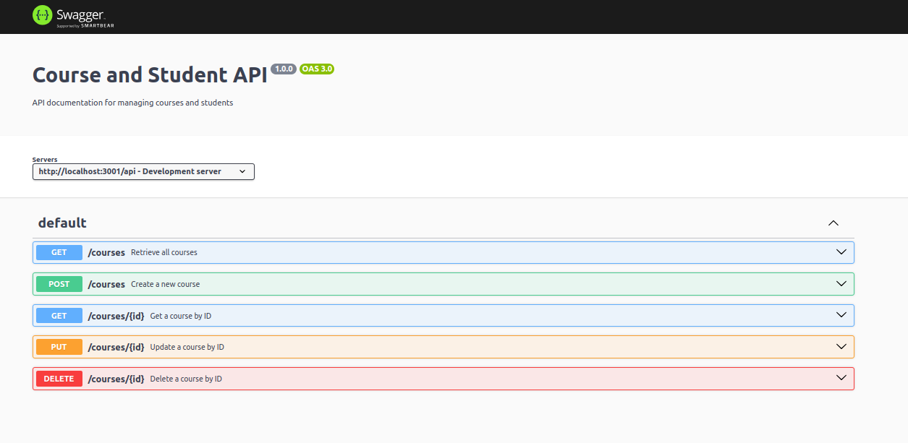
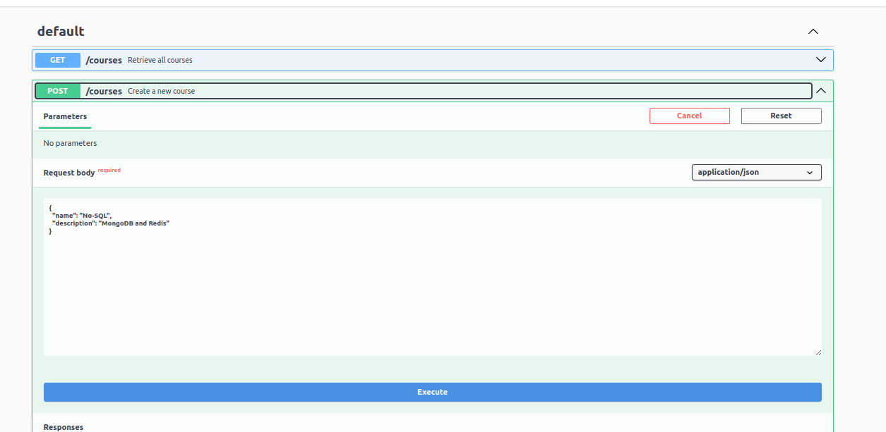
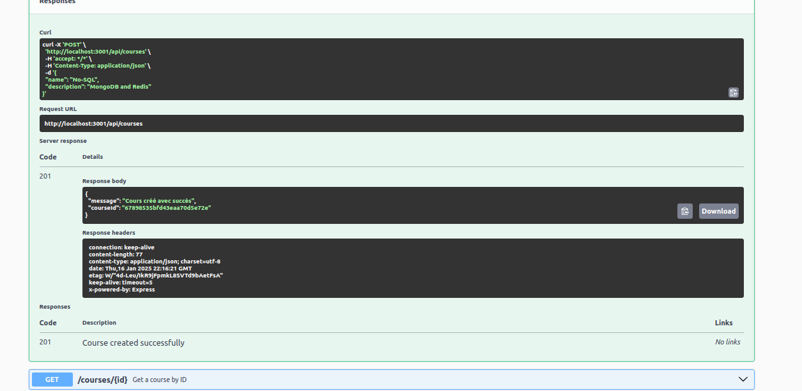
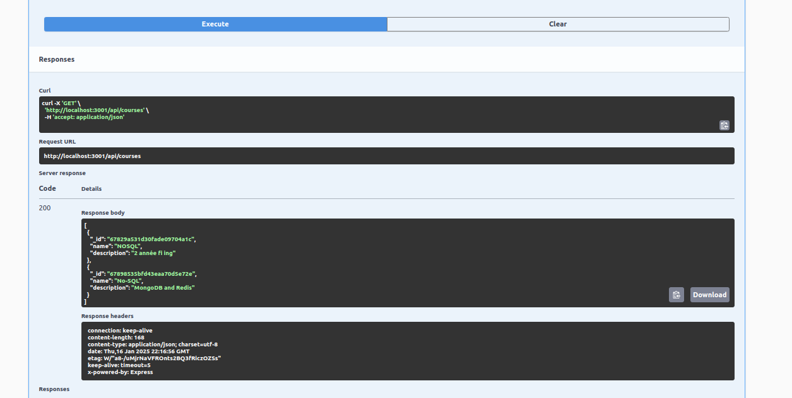

# Le fichier docker-compose.yml

Ce fichier configure les services nécessaires pour l'application:

**learning_app :** Application principale Node.js connectée à MongoDB et Redis.

**database :** Service MongoDB pour le stockage des données.

**redis_cache :** Service Redis pour la mise en cache.

**redis_monitor :** Interface RedisInsight pour surveiller les performances et gérer Redis.

## Démarer l'application :

    docker-compose ps

## Documentation acvec `swagger-ui`

**On peut "executé les mêmes requêtes pour la collectin `Student` en utilisant `swagger-ui`**

# Réponses aux questions

**app.js :**

1. **Organisation du point d'entrée**  
   On centralise le démarrage dans un fichier principal (`app.js`). Les responsabilités comme la gestion des routes, des middlewares et des configurations sont déléguées à des modules spécifiques (`config/`, `routes/`) pour améliorer la lisibilité et la maintenabilité du serveur.

2. **Meilleure gestion du démarrage**  
   On utilise des fonctions asynchrones pour gérer les connexions tout en capturant les erreurs. On implémente également une gestion propre des signaux système (`SIGTERM`) pour libérer les ressources. Enfin, on sépare les configurations par environnement en utilisant le `dotenv`.

**config.js:**

1. **Pourquoi créer un module séparé pour les connexions aux bases de données ?**  
   On crée un module dédié pour centraliser la logique de connexion, ce qui améliore la réutilisabilité du code. Cela permet également de séparer les responsabilités, rendant le point d'entrée de l'application plus clair.

2. **Comment gérer proprement la fermeture des connexions ?**  
   On s'assure de vérifier si chaque client de base de données (MongoDB, Redis) est initialisé avant de fermer la connexion. Les fermetures sont effectuées dans la fonction (`closeConnections`), qui appelées lors des événements système (`SIGTERM`) dans le ficher **app.js**.

**courseRoutes:**

1. **Pourquoi séparer les routes dans différents fichiers ?**  
   On sépare les routes dans différents fichiers pour respecter le principe de séparation des responsabilités. Chaque fichier est dédié à une entité ou une fonctionnalité spécifique, ce qui rend le code modulaire et bien strcutré.

2. **Comment organiser les routes de manière cohérente ?**  
   On regroupe les routes par entité (`courseRoutes`, `studentRoutes`) dans des fichiers distincts. Chaque route doit avoir une structure bien définit pour effectuer des opérations(CRUD : `GET`, `POST`, `PUT`, `DELETE`). Les fichiers de routes sont importés et montés dans le fichier principal via des chemins, comme `/api/courses`.

**courseController:**

1. **Quelle est la différence entre un contrôleur et une route ?**  
   Une route sert à définir les points d'entrée de l'API et à associer chaque point à un contrôleur. Le contrôleur contient la logique métier liée à ces points, comme les interactions avec les bases de données, la validation des données envoyée, validation des permissions et la gestion des erreurs.

2. **Pourquoi séparer la logique métier des routes ?**  
   La séparation de la logique métier des routes permet de garder les routes simples et lisibles, tout en regroupant la logique dans les contrôleurs.

**mongoService:**

**Question: Pourquoi créer des services séparés ?**  
Créer des services séparés permet de centraliser la logique d'accès aux données (`DAO`) ou d'autres tâches répétitives (les appels à une base de données, le caching ou les appels à une API externe). Cela garanti :

1. **Réutilisabilité** : Les services peuvent être utilisés par plusieurs contrôleurs.
2. **Modularité** : Cela rend le code plus organisé et modulaire.
3. **Lisibilité** : En déplaçant la logique spécifique des bases de données ou des services externes vers une couche dédiée.
4. **Respect des bonnes pratiques** : Cette séparation suit le principe de responsabilité unique (SRP) en limitant la responsabilité de chaque module à une tâche spécifique.

**redisService**

**Question : Comment gérer efficacement le cache avec Redis ?**

1. **Utilisation d'une durée de vie (TTL)** : On assigne un TTL aux clés pour éviter qu'elles ne restent indéfiniment en mémoire. Cela garantit que les données obsolètes sont automatiquement supprimées.
2. **Organisation les données** : On stock les données sérialisées en JSON pour simplifier la récupération et la mise en cache de structures complexes.
3. **Le monitorin de Redis** : On utilise des outils comme Redis Insight pour surveiller les performances et identifier les éventuels problèmes de saturation.
4. **Limitation des requêtes au cache**

**Question : Quelles sont les bonnes pratiques pour les clés Redis ?**

1. **Utilisation de conventions structurées**

   - On forme des clés descriptives au format `namespace:type:identifier` (`user:profile:1234`).
   - On limite la taille des clés pour optimiser la mémoire.

2. **Organisation et prévention des collisions**

   - On utilise des namespaces uniques pour éviter les conflits entre applications.
   - On groupe les clés associées sous un même namespace (`product:details:456`).

3. **Gestion efficace avec TTL**
   - On configure le TTL (Time-To-Live) pour limiter la persistance des données.
